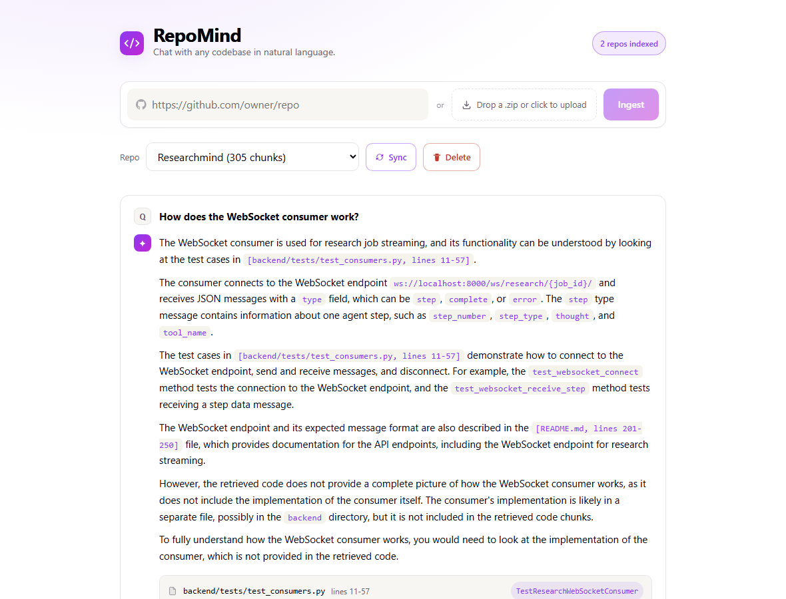

# RepoMind

Chat with any codebase in natural language. Point it at a GitHub repo (or a
zip file), it clones and indexes the code with AST-aware chunking and hybrid
retrieval, and you can ask it things like "how does auth work?" or "what
calls this function?" and get an answer grounded in the actual code, with
file/line citations.



## Why this exists

Most "chat with your repo" projects are a thin wrapper around an embedding
model and a vector store — embed everything, cosine-similarity search, stuff
the top-k into a prompt. That works fine for a demo GIF and falls apart the
moment you ask something like "what does `manage.py` do?" and the retriever
has no idea `manage.py` even exists, because nothing in the *code itself*
mentions its own filename.

RepoMind is built around a retrieval pipeline that actually gets tested
against that failure mode, not just eyeballed:

1. **AST-aware chunking** with tree-sitter — functions, classes, and methods
   are chunked at their real boundaries (Python, JS/TS/TSX, Java, Go), not
   sliced every N lines. Everything else falls back to a sliding window.
2. **Hybrid retrieval** — BM25 keyword search and dense semantic search
   (`codebert-base`) run in parallel and get merged with Reciprocal Rank
   Fusion, over text that includes the file path and symbol name, not just
   the code body. That's the difference between finding `manage.py` and not.
3. **Query rewriting** (Groq/Llama 3.3) expands vague questions into more
   specific search queries before retrieval runs.
4. **Cross-encoder reranking** re-scores the fused shortlist against the
   actual question before anything reaches the LLM — RRF is good at recall,
   bad at fine-grained relevance.
5. **Multi-turn context** — a follow-up like "and where is it initialized?"
   gets resolved against the conversation history before retrieval, so
   pronouns don't silently break search.

I measured what each of these steps actually buys you — see
[Retrieval quality](#retrieval-quality) below.

## Features

- Ingest a public GitHub repo or a local `.zip`
- Streaming answers (SSE), token-by-token, not a spinner-then-dump
- Per-query pipeline trace — see exactly where the latency goes (rewrite /
  retrieve / rerank / generate), rendered as a breakdown in the UI
- Incremental re-sync — hashes every file and only re-chunks/re-embeds what
  actually changed, instead of re-indexing the whole repo every time
- A CLI (`repomind ingest / ask / sync / repos / delete`) that runs the same
  pipeline from a terminal, no server required
- Retrieval evaluation harness with a real measured report, not a claim

## Retrieval quality

18 hand-labeled questions against a 76-file production-sized repo, run
through three retrieval strategies:

| Strategy | Hit@1 | Hit@5 | MRR |
|---|---|---|---|
| semantic-only | 6% | 17% | 0.081 |
| hybrid (BM25 + semantic, no rerank) | 22% | 28% | 0.233 |
| hybrid + rerank + query rewrite (what actually ships) | 17% | 56% | 0.298 |

Hybrid retrieval roughly triples Hit@5 over semantic-only, and reranking
takes it further, to 56%. The one number that *doesn't* improve in a
straight line: Hit@1 drops slightly in the full pipeline. Digging into the
per-question breakdown, that's query rewriting occasionally expanding a
literal question ("what does `backend/manage.py` do?") into paraphrased
variants, which then pulls the cross-encoder — trained on general web
relevance, not code — toward README prose instead of the file itself. Net
win overall, but not a free one. Full per-question breakdown and repro
command: [`backend/eval/RESULTS.md`](backend/eval/RESULTS.md).

## Architecture

```
Ingest:  clone/upload → filter → tree-sitter chunk → embed → ChromaDB + SQLite
Query:   contextualize (history) → rewrite (Groq) → hybrid search (BM25 + semantic, RRF)
         → cross-encoder rerank → stream answer (Groq) → cited response
```

| Layer | Choice |
|---|---|
| Backend | FastAPI, Python 3.11+ |
| Frontend | React + Vite + TypeScript |
| Code parsing | tree-sitter |
| Embeddings | `sentence-transformers` (`microsoft/codebert-base`) |
| Vector store | ChromaDB (embedded, local) |
| Keyword search | `rank-bm25` |
| Reranking | `cross-encoder/ms-marco-MiniLM-L-6-v2` |
| Metadata | SQLite |
| LLM | Groq (`llama-3.3-70b-versatile`) |
| CLI | Click + Rich |

Ingestion, sync, and query orchestration live in `backend/pipeline.py`,
shared by the FastAPI app, the CLI, and the eval harness — one implementation,
three entry points, instead of the API layer being the only place the logic
exists.

## Running it

**Backend**

```bash
cd backend
python -m venv .venv
.venv\Scripts\activate        # .venv/bin/activate on macOS/Linux
pip install -r requirements.txt
cp .env.example .env          # add your GROQ_API_KEY
uvicorn main:app --port 8000
```

First run downloads the embedding model (~500MB) and the reranker (~80MB) —
that's a one-time cost, cached afterward.

**Frontend**

```bash
cd frontend
npm install
npm run dev
```

Open `http://localhost:5173`.

**CLI**

```bash
cd backend
pip install -e .
repomind ingest https://github.com/owner/repo
repomind ask "how does auth work?" --repo <repo_id>
```

**Evaluation harness**

```bash
cd backend
python -m eval.run_eval --repo-id <repo_id> --dataset eval/datasets/researchmind.json
```

## Known limitations

- Embedding and reranking run on CPU locally. Fine for small-to-medium repos
  (seconds); a repo the size of Flask takes several minutes to fully embed
  on a first ingest. Incremental sync avoids paying that cost again for
  unchanged files, but the first ingest of a large repo is still slow.
- The CLI starts a fresh Python process per invocation, so it cold-starts
  the ML models every time (~30s) — there's no persistent daemon behind it
  the way the web server has. Fine for occasional use, not for scripting a
  tight loop of `repomind ask` calls.
- Single-user, local tool. No auth, no multi-tenancy — every ingested repo
  is visible to whoever can hit the API.
- `.env` files are skipped during ingestion, but this isn't a substitute for
  not pointing it at a repo you don't trust — code is never executed, but
  it is read into an LLM prompt.

## Project layout

```
backend/
  main.py            FastAPI app, all HTTP routes
  pipeline.py        shared ingest/sync/query orchestration
  cli.py             repomind CLI (Click + Rich)
  timing.py          per-stage latency instrumentation
  ingestion/         cloner, file filter, tree-sitter chunker, embedder
  retrieval/         BM25 + semantic hybrid search, RRF, reranker, query rewriter
  generation/        answer generation (streaming + non-streaming)
  db/                ChromaDB + SQLite clients
  eval/              evaluation harness + labeled datasets
frontend/
  src/components/    RepoInput, ChatBox, AnswerCard, CodeBlock, PipelineTrace, ...
  src/api.ts         typed API client (incl. SSE streaming)
```
